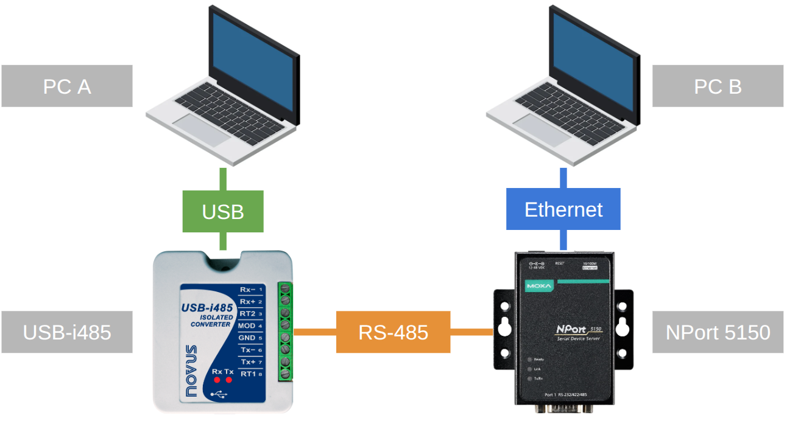
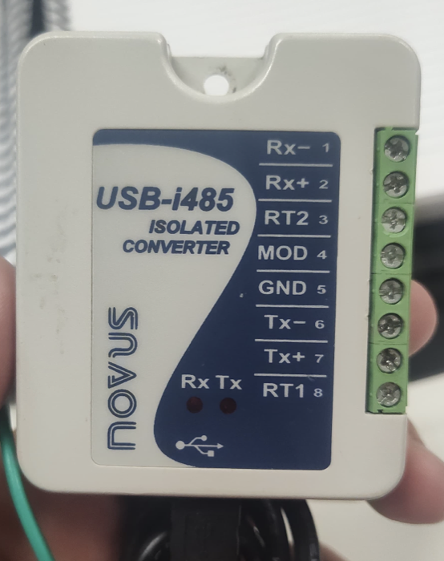
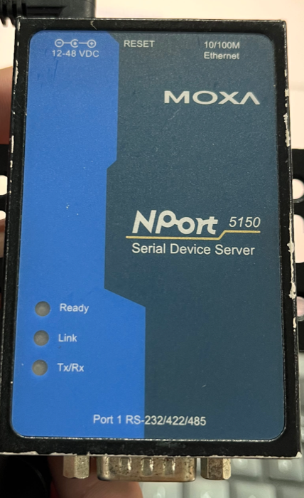

# Prática 1 — Gateway Conversor de Meio Físico

**Universidade SENAI CIMATEC** — Engenharia da Computação
Redes Industriais 2026.2 — Prof. José Marcelo de Assis Santos — Salvador, 2026

> "Dado o respectivo gateway conversor de meio físico, implemente uma solução via
> software onde seja possível comunicar 2 dispositivos através desse gateway
> conversor de meio físico. Utilizar um desses meios físicos: RS-232, RS-422, RS-485."

Meio físico escolhido: **RS-485 Half Duplex (2 fios)**.

Andrei Boulhosa de Sant'Anna · Enzo Bacelar Conte Gebauer · Francielle Andrade
Cardoso · Gabriel de Araujo Santos Rocha · João Vítor de Carvalho Côrtes · Lucas
Santana Cristovam dos Santos · Matheus Freitas Pereira · Orlando Mota Pires

---

## Topologia



```
Computador A → USB → USB-i485 → RS-485 → NPort 5150 → Ethernet → Computador B
```

O ponto da montagem: **nenhum dos dois computadores conhece o meio do outro.** O A
escreve bytes numa porta serial e não sabe que existe rede. O B abre um socket TCP
e não sabe que existe RS-485. O NPort 5150 traduz no meio, tunelando os bytes crus
de um meio físico para o outro sem interpretar conteúdo.

```bash
pip install -r requirements.txt
```

---

## Equipamentos

### NOVUS USB-i485



Converte USB em RS-485/RS-422. O sistema operacional o enxerga como porta serial
virtual, então qualquer software serial fala com o barramento industrial sem saber
que há um conversor no caminho. Tem **isolamento galvânico** entre o lado USB e o
lado RS-485, LEDs de Rx e Tx, e **controle automático de direção** — o transceptor
inverte sozinho entre transmitir e receber, sem intervenção do software.

Opera em RS-485 Half Duplex, RS-485 Full Duplex ou RS-422. Chip FTDI (VID `0403`).

**Terminais:**

| 1 | 2 | 3 | 4 | 5 | 6 | 7 | 8 |
|---|---|---|---|---|---|---|---|
| Rx- | Rx+ | RT2 | MOD | GND | Tx- | Tx+ | RT1 |

`RT1` e `RT2` habilitam os resistores de terminação internos (conexão opcional,
conforme manual NOVUS). `MOD` seleciona o modo de operação.

### Moxa NPort 5150



Serial device server: disponibiliza uma porta serial através da rede Ethernet.
Uma porta DB9 (RS-232, RS-422, RS-485 2 fios e 4 fios), Ethernet 10/100 Mbps,
alimentação 12–48 VDC. LEDs **Ready**, **Link** e **Tx/Rx**. Também faz controle
automático de direção em RS-485 2 fios.

---

## Por que RS-485

| | RS-232 | RS-422 | RS-485 |
|---|---|---|---|
| Sinalização | Referenciada ao terra | Diferencial | Diferencial |
| Condutores | Sinal + terra comum | Pares separados Tx e Rx | 2 fios (half) ou 4 (full) |
| Topologia | Ponto a ponto | Ponto a multiponto | Multiponto, até 32 nós |
| Distância | Curta | Longa | Longa |

Na **transmissão diferencial** o bit não é a tensão de um condutor contra o terra,
mas a **diferença de tensão entre os dois condutores**. Ruído eletromagnético entra
praticamente igual nos dois fios, e a subtração o cancela. É isso que faz o RS-485
aguentar centenas de metros em ambiente industrial onde o RS-232 não passa de
alguns — e é o motivo de ele predominar em automação.

### Half Duplex

Nesta prática o RS-485 opera em **Half Duplex**: o mesmo par de fios serve para
transmitir e receber. Como o par é compartilhado, um lado transmite por vez, e o
transceptor precisa inverter o sentido entre as duas operações. Os dois
equipamentos fazem essa comutação por hardware, automaticamente.

---

## Ligação física

Com tudo desenergizado. O terminal **MOD (4) fica sem conexão** — é isso que
seleciona Half Duplex no USB-i485.

| USB-i485 | | NPort 5150 (DB9) |
|---|---|---|
| **Rx+ (2)** unido a **Tx+ (7)** | → | pino **3** — Data+ |
| **Rx- (1)** unido a **Tx- (6)** | → | pino **4** — Data- |
| **GND (5)** | → | pino **5** — GND |

> **Rx e Tx são terminais separados no USB-i485 e precisam ser unidos entre si.**
> Em Half Duplex o par de dados é um só: `Rx+` com `Tx+` formam o Data+, `Rx-` com
> `Tx-` formam o Data-. Ligar apenas o par Rx ao NPort é o erro que trava a
> montagem inteira — o computador A consegue escutar, mas nunca transmite, e o
> barramento fica sem nenhum driver ativo. Os dois receptores passam a flutuar e
> **os dois lados recebem lixo contínuo**, sintoma que parece ruído elétrico ou
> baud rate errada e não é nenhum dos dois.

Use par trançado. **Não pule o GND** — o fabricante recomenda explicitamente ligar
o terminal comum entre os dispositivos: sem referência de tensão comum, os
transceptores podem ser danificados por diferença de potencial entre os dois lados.

Antes de energizar, confirme a correspondência dos condutores do cabo DB9 com um
**multímetro**, em continuidade. Inversão de Data+/Data- é o erro mais comum em
RS-485 e impede a comunicação ou entrega dados corrompidos.

---

## Configuração

### USB-i485 (Computador A)

Reconhecido como porta serial virtual. Parâmetros:

| | |
|---|---|
| Baud rate | 9600 |
| Formato | 8N1 — 8 bits de dados, sem paridade, 1 stop bit |
| Controle de fluxo | Nenhum |

No Linux o driver `ftdi_sio` é nativo. No Windows e macOS, instale o driver **VCP**
da FTDI (não o D2XX — no D2XX o dispositivo não aparece como porta COM). Nas
propriedades avançadas da porta, mude o **Latency Timer de 16 ms para 4 ms**.

Confirme que a porta apareceu:

```bash
# Computador A
python diagnostico.py
```

> O nome da porta **não é estável**: no macOS ele codifica o conector USB físico
> (`cu.usbserial-120`, `-130`), no Windows o número da COM muda por entrada, no
> Linux é a ordem de conexão. Por isso os scripts do lado A acham a porta sozinhos
> pelo VID do FTDI quando `--porta` é omitido.

### NPort 5150 (Computador B)

Energize com a fonte 12–48 VDC antes de conectar a Ethernet. LED **Ready** verde
fixo indica boot correto; piscando vermelho é conflito de IP ou falha.

Acesse o console web do Computador B — ele precisa estar na mesma faixa do NPort
(`192.168.127.x` no padrão de fábrica):

```
http://192.168.127.254   (senha: moxa)
```

| Campo | Valor |
|---|---|
| Serial Settings → Interface | `RS-485 2-wire` |
| Baud rate / paridade / stop bits | `9600 8N1`, sem controle de fluxo |
| Operating Settings → Operation Mode | `TCP Server` |
| Operating Settings → Data Port | `4001` |

Em **TCP Server Mode** o NPort aguarda uma solicitação de conexão vinda da rede e,
a partir dela, encaminha os dados entre o socket e a interface serial. É o modo que
dispensa driver proprietário no Computador B — socket puro resolve.

**Interface é o campo que mais dá problema.** Em `RS-232` ou `RS-422/4-wire` o
transmissor do NPort fica ligado o tempo todo em vez de entrar em alta impedância,
e passa a disputar a linha com o conversor.

Confirme o alcance:

```bash
# Computador B
python diagnostico.py --tcp <IP_do_NPort>:4001
```

**RECUSADO** = o NPort não está em TCP Server mode. **TIMEOUT** = rede: IP, faixa
ou cabo. O Computador A não precisa enxergar o NPort pela rede — ele fala só serial.

---

## Software

| Arquivo | Onde roda | O que faz |
|---|---|---|
| `chat_serial.py` | A | Chat bidirecional pela serial, atravessando o RS-485 |
| `chat_tcp_nport.py` | B | Chat pelo outro lado do gateway, via socket TCP |
| `diagnostico.py` | A e B | Lista portas, testa loopback físico, testa alcance TCP |
| `sniffer.py` | A | Bytes crus em hexa; separa problema elétrico de baud rate |
| `sniffer_tcp.py` | B | O mesmo, pelo lado TCP do gateway |
| `portas.py` | — | Acha o conversor pelo VID do chip FTDI |
| `analise.py` | — | Interpretação dos bytes, usada pelos dois sniffers |

Os dois lados usam **threads**: uma cuida da recepção enquanto a principal lê o que
o usuário digita, o que permite comunicação bidirecional sem travar a digitação.
As mensagens terminam em `\n`, que delimita cada mensagem na recepção, e levam um
identificador do computador de origem.

```
Computador A → PySerial → USB-i485 → RS-485 → NPort 5150 → TCP/IP → socket → Computador B
```

### Execução

```bash
# Computador A
python chat_serial.py --nome A

# Computador B
python chat_tcp_nport.py --host <IP_do_NPort> --nome B
```

Digite dos dois lados. A mensagem digitada no A sai como bytes seriais, cruza o
RS-485, entra no NPort, sai como TCP e aparece no B — e vice-versa.

---

## Validação, em ordem

Cada teste elimina um suspeito. Pular direto pro chat e algo falhar deixa fiação,
modo do NPort, IP e baud rate como suspeitos simultâneos.

### 1. O barramento está em silêncio?

Com **ninguém digitando dos dois lados**:

```bash
# Computador A
python sniffer.py --segundos 120

# Computador B
python sniffer_tcp.py --host <IP_do_NPort> --segundos 120
```

Byte chegando com ninguém transmitindo é problema **elétrico**, e nenhuma mudança
de baud rate resolve. Use janela larga: ruído esporádico não aparece em 10 s, mas
o chat acumula ao longo de minutos e acaba mostrando.

### 2. O conversor transmite e recebe?

Desconecte o fio que vai para o NPort e ponteie temporariamente Rx+ com Tx+ e
Rx- com Tx- no bloco do USB-i485:

```bash
# Computador A
python sniffer.py --enviar "PING-123" --segundos 5
```

| Resultado | Leitura |
|---|---|
| Volta `PING-123` limpo | Conversor e driver OK |
| Não volta nada | Conversor não transmite — suspeite do MOD |

### 3. Os bytes atravessam o caminho inteiro?

Com a fiação real montada, transmita de A e escute em B:

```bash
# Computador B, primeiro
python sniffer_tcp.py --host <IP_do_NPort> --segundos 15

# Computador A, em seguida
python sniffer.py --enviar "PING-123" --segundos 5
```

O lado B deve mostrar exatamente `50 49 4E 47 2D 31 32 33 0A`. Volume muito maior
que os 9 bytes enviados indica divergência de baud rate — 90 bytes para 9 enviados
significa receptor ~10× acima do transmissor.

Para descobrir a taxa de quem está transmitindo:

```bash
python sniffer.py --varrer --segundos 30
```

---

## Troubleshooting

| Sintoma | Causa provável |
|---|---|
| Console web do NPort não abre | PC fora da faixa `192.168.127.x` |
| `diagnostico.py` não lista porta nenhuma | Driver FTDI ausente, ou em D2XX em vez de VCP |
| `No such file or directory` na porta | Cabo replugado em outra entrada USB — omita `--porta` |
| `--tcp` dá RECUSADO | NPort em Real COM em vez de TCP Server |
| `--tcp` dá TIMEOUT | IP, faixa de rede ou cabo Ethernet |
| Lixo contínuo com ninguém digitando | Ver bloco abaixo |
| Loopback não retorna nada | Ponte errada ou MOD conectado |
| Chat não passa em nenhuma direção | Polaridade Data+/Data- invertida |
| Chat passa num sentido só | NPort em RS-422/4-wire em vez de RS-485 2-wire |
| Mensagens com atraso perceptível | Latency Timer ainda em 16 ms |

### Lixo contínuo mesmo sem ninguém transmitir

Não é baud rate — baud errada corrompe o que passa, não fabrica byte do nada.
Rode o teste 1 nas duas pontas: **de que lado o lixo aparece elimina metade dos
suspeitos.**

| Onde aparece | Provável causa |
|---|---|
| Nos dois lados | Barramento sem driver ativo — confira se Tx+/Tx- foram ligados ao par de dados |
| Só no B, A em silêncio | Par RS-485 aberto entre os dois |
| Só no A, B em silêncio | Ruído local no conversor ou cabo USB perto de fonte chaveada |

Em RS-485 2 fios, quando ninguém transmite os drivers ficam em alta impedância.
Sem bias fail-safe a diferença de tensão fica em ~0 V, o receptor oscila com ruído
e inventa start bits indefinidamente. O USB-i485 traz os terminais `RT1`/`RT2` para
terminação; o NPort 5150 tem jumpers internos de terminação de 120 Ω e bias.

Caractere **idêntico se repetindo** não é ruído: ruído é aleatório. Padrão que
repete é dispositivo real transmitindo numa taxa diferente da que você está lendo
— use `--varrer` para descobrir qual.

---

## Testando sem hardware

Portas seriais virtuais permitem validar a lógica dos dois lados antes de ter os
equipamentos:

```bash
socat pty,raw,echo=0,link=/tmp/ttyA pty,raw,echo=0,link=/tmp/ttyB &

python chat_serial.py --porta /tmp/ttyA --nome A &
python chat_serial.py --porta /tmp/ttyB --nome B
```

No Windows o equivalente é o com0com. Separa erro de código de erro de fiação, que
é onde se perde mais tempo nesse tipo de montagem. Portas virtuais não têm VID,
então aqui `--porta` é obrigatório.

---

## Referências

- ANALOG DEVICES. *AN-960: RS-485/RS-422 circuit implementation guide.*
  https://www.analog.com/en/resources/app-notes/an-960.html
- MOXA. *NPort 5000 Series: user's manual.*
- MOXA. *NPort 5150: general device servers.*
- NOVUS AUTOMATION. *USB-i485 converter: instruction manual.*
- TANENBAUM, A. S.; WETHERALL, D. J. *Computer networks.* 5. ed. Boston: Prentice Hall, 2011.

Fotos dos equipamentos e diagrama de topologia: acervo da equipe.
